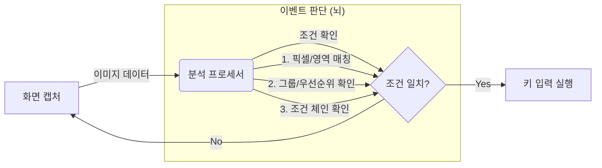

# 키스트로크 시뮬레이터 (Keystroke Simulator) 사용 설명서

환영합니다! 이 프로그램은 여러분의 컴퓨터 화면을 **"보고"**, 특정 상황이 발생하면 자동으로 **"키를 눌러주는"** 스마트한 매크로 도구입니다. 복잡한 반복 작업을 자동화하거나, 게임 등에서 특정 이미지/색상을 인식해 반응하는 용도로 사용할 수 있습니다.

이 문서는 프로그램의 작동 원리부터 전문가 수준의 설정 방법까지 모든 것을 다룹니다.

---

## 1. 작동 원리 (Mechanism)

이 앱은 단순한 매크로가 아닙니다. **눈(Vision)**과 **뇌(Logic)**, 그리고 **손(Action)**이 있는 로봇과 같습니다.

프로세서는 **5단계 파이프라인**으로 동작합니다:

1.  **수집 (Collect):** 화면의 mega_rect 영역을 한 번에 캡처하고, 각 이벤트의 픽셀/영역 매칭 결과(raw state)를 수집합니다.
2.  **해석 (Resolve):** 조건 체인을 DFS로 순회하며 각 이벤트의 실효 활성 상태(effective state)를 계산합니다.
3.  **상태 갱신 (Update):** 스레드 안전하게 `current_states`를 업데이트합니다.
4.  **필터 (Filter):** 조건을 만족하는 이벤트만 후보로 추립니다.
5.  **실행 (Execute):** 그룹 우선순위를 적용한 뒤 최종 선택된 이벤트의 키를 입력합니다.

---

## 2. 메인 화면 구성

프로그램을 실행하면 가장 먼저 만나는 화면입니다.

1.  **Process (프로세스):** 매크로를 적용할 타겟 프로그램(게임, 웹브라우저 등)을 선택합니다. `Refresh` 버튼으로 목록을 갱신할 수 있습니다.
2.  **Profile (프로필):** 여러 가지 설정 묶음을 저장하고 불러옵니다. `Copy`(복사), `Delete`(삭제)로 관리합니다. **변경사항은 자동 저장됩니다** (250ms 디바운스).
3.  **Start/Stop:** 매크로를 시작하거나 멈춥니다.
4.  **Quick Events:** 빠르고 간단하게 이벤트를 추가하는 미니 에디터입니다.
5.  **Settings:** 시작/중지 키, 키 누름 시간, 루프 간 지연 등을 설정합니다.
6.  **ModKeys:** Alt, Ctrl, Shift 같은 특수 키의 동작을 설정합니다.
7.  **Edit Profile:** 현재 프로필의 이벤트를 상세하게 수정하는 **핵심 기능**입니다.
8.  **Graph:** 이벤트 간 의존 관계를 방향 그래프로 시각화합니다.

---

## 3. 프로필 이벤트 에디터 (Edit Profile) - **핵심 기능**

`Edit Profile` 버튼을 누르면 나오는 화면입니다. 여기서 로봇의 "지능"을 만듭니다.

### 리스트 화면
이벤트 목록이 나옵니다.
*   **Use:** 체크 해제하면 해당 이벤트는 잠시 꺼둡니다.
*   **독립 스레드 아이콘:** 번개 아이콘은 "독립 스레드"로 동작함을 의미합니다 (매우 빠름).
*   **Group:** 같은 그룹끼리는 동시에 실행되지 않고 순서를 따집니다.
*   **Actions:** 수정, 복사, 삭제

---

### 이벤트 설정 창

`Add Event`나 수정 버튼을 누르면 나오는 상세 설정 창입니다. **3개의 탭**으로 나뉩니다.

#### 탭 1: 기본
가장 기초적인 "어디를 보고 무슨 키를 누를지" 정합니다.

*   **이벤트 이름:** 이벤트를 구분하는 이름입니다. 조건 설정 시 이 이름으로 참조됩니다.
*   **이미지 뷰어:**
    *   **왼쪽 (빨강):** 현재 마우스 위치의 실시간 화면.
    *   **오른쪽 (회색):** `Ctrl`을 눌러서 캡처한 "목표 이미지"입니다.
    *   **Ref (작은 박스):** 비교할 기준이 되는 딱 하나의 "기준 픽셀" 색상입니다.
*   **단축키:**
    *   **`Alt`:** 마우스 좌표(영역)만 가져옵니다.
    *   **`Ctrl`:** 현재 마우스 위치의 이미지를 캡처(Grab)합니다.
*   **좌표 (Area X/Y, Pixel X/Y):** 자동으로 입력되지만, 미세 조정이 필요하면 숫자를 바꿉니다.
*   **Key:** 조건이 맞았을 때 누를 키를 선택합니다.

#### 탭 2: 상세 설정
더 정교한 이미지 인식 방법과 타이밍을 설정합니다.

*   **매칭 모드:**
    *   **픽셀 (1px):** 딱 점 하나(픽셀)의 색상만 봅니다. 속도가 매우 빠릅니다. 고정된 UI(체력바, 스킬 아이콘)에 적합합니다.
    *   **영역 (Area):** 일정 영역(사각형) 전체를 5개 체크포인트로 비교합니다. 이미지가 조금 움직이거나 패턴을 찾아야 할 때 씁니다.
*   **반전 매칭 (불일치 시 트리거):** 체크하면 지정한 픽셀/영역이 일치하지 **않을 때** 이벤트가 활성화됩니다. 예를 들어, "체력바가 가득 찰 때의 색상"을 등록하고 반전 매칭을 켜면 "체력이 줄었을 때" 트리거됩니다.
*   **영역 크기 (너비/높이):** 영역 모드일 때 검사할 사각형의 크기입니다.
*   **타이밍 (전역 설정 덮어쓰기):**
    *   **지속 시간 (ms):** 키를 얼마나 오래 누르고 있을지 설정합니다.
    *   **랜덤 (ms):** 기계적인 느낌을 줄이기 위해 누르는 시간을 랜덤하게 ± 합니다. (예: 100ms ± 10ms)
*   **독립 스레드:**
    *   체크하면 이 이벤트는 **별도의 스레드**를 할당받습니다.
    *   다른 이벤트들이 검사하느라 바빠도, 이 이벤트는 독자적으로 초고속으로 감시하고 실행합니다. (반응속도가 생명인 물약 먹기 등에 사용)
    *   독립 스레드 이벤트는 그룹/조건 로직을 바이패스합니다.

#### 탭 3: 조건 / 그룹 - **고급 기능**
단순 반복이 아닌 "판단"을 하게 만듭니다.

*   **실행 유형:**
    *   **키 입력 실행:** 체크를 끄면 키를 누르지 않습니다. "조건 감시 전용" 이벤트로만 사용됩니다. 다른 이벤트의 조건으로 참조될 수 있습니다.
*   **그룹:**
    *   **그룹 ID:** 여러 이벤트를 하나의 그룹으로 묶습니다. (예: '공격스킬' 그룹)
    *   **우선순위:** 그룹 내에서 누가 더 중요한지 정합니다. (숫자가 낮을수록 우선순위 높음).
    *   *원리:* 같은 그룹 내에서는 한 번에 딱 하나의 이벤트만 실행됩니다. 우선순위 높은 것이 발동 조건이 되면, 낮은 것은 무시됩니다.
*   **조건:** **"다른 이벤트의 상태"**를 조건으로 겁니다.
    *   아래 리스트에서 다른 이벤트를 **클릭하여 상태를 순환**시킵니다:
    *   `무시`: 상관없다 (조건에 포함하지 않음).
    *   `활성 필요`: 저 이벤트가 켜져 있어야(매칭 중이어야) 나도 활성화된다.
    *   `비활성 필요`: 저 이벤트가 꺼져 있어야(매칭 안 될 때) 내가 활성화된다.
    *   *예시:* "보스 몬스터 체력바(이벤트 A)"가 `활성 필요`일 때만 "필살기(이벤트 B)"를 쓴다.
    *   **순환 의존 감지:** DFS 기반으로 순환 참조를 자동 감지하여 무한 루프를 방지합니다.

---

## 4. 이벤트 의존성 그래프 (Graph)

메인 화면 또는 프로필 편집기에서 **Graph** 버튼을 누르면, 현재 프로필의 모든 이벤트 간 의존 관계를 **방향 그래프**로 시각화합니다.

*   **노드**: 각 이벤트를 나타냅니다.
*   **화살표**: 조건 의존 관계를 나타냅니다 (A → B = "B는 A의 상태에 의존").
*   **그룹 배경**: 같은 그룹의 이벤트는 같은 색상 배경으로 표시됩니다.
*   **뱃지**: 이벤트 상태를 아이콘으로 표시합니다:
    *   독립 스레드, 비활성(사용 안 함), 조건 감시 전용, 누락된 조건 참조 등.
*   **레이아웃**: 위상 정렬 + 무게 중심 최적화로 읽기 쉬운 배치를 자동 생성합니다.
*   **캐시**: 해시 기반 무효화로 변경이 없으면 이전 이미지를 재사용합니다.
*   **ESC** 키로 그래프 창을 닫을 수 있습니다.

---

## 5. 가져오기 기능 (Import)

다른 프로필에서 이미 잘 만들어둔 이벤트를 가져올 수 있습니다.

1.  Event List 창에서 `Import From` 버튼을 누릅니다.
2.  **Profile:** 가져올 원본 프로필을 선택합니다.
3.  **Events:** 가져오고 싶은 이벤트들을 체크합니다.
4.  `OK`를 누르면 현재 프로필로 복사됩니다.

---

## 6. 퀵 이벤트 에디터 (Quick Events)

메인 화면의 `Quick Events` 버튼입니다. 복잡한 설정 없이 빠르게 좌표와 이미지만 따고 싶을 때 씁니다.

1.  창을 켜두고 게임 화면 위에 마우스를 올립니다.
2.  **`Alt`**: 좌표 확인 / **`Ctrl`**: 이미지 캡처 및 저장.
3.  캡처된 내용은 자동으로 `Quick.pkl` 프로필에 저장됩니다. 나중에 정식 에디터에서 불러와서 다듬으면 편합니다.

---

## 7. 특수 키 제어 (ModKeys)

메인 화면의 `ModKeys` 버튼입니다.
매크로가 돌아가는 도중 여러분이 `Alt`, `Ctrl`, `Shift` 등을 눌렀을 때 어떻게 할지 정합니다.

*   **Enabled:** 체크하면 해당 특수 키 감지를 켭니다.
*   **Combobox (Key):** 특수 키를 눌렀을 때 대신 누를 키를 지정합니다. (예: 내가 Alt를 누르면 매크로는 'K'를 누른 것으로 인식)
*   **Pass:** 체크하면 매크로를 **잠시 멈추고** 여러분의 키 입력을 컴퓨터에 그대로 전달합니다. 매크로 중 수동 조작이 필요할 때 유용합니다.

---

## 8. 환경 설정 (Settings)

*   **Start/Stop Key (시작/중지 키):** 매크로를 켜고 끌 단축키를 지정합니다. macOS에서는 Alt+Shift 조합을 사용합니다.
*   **Key pressed time (키 누름 시간) (min, max):** 키를 누르고 있는 시간 범위입니다. (너무 짧으면 게임이 인식을 못 합니다. 보통 95~135ms 추천)
*   **Delay between loop (루프 간 지연) (min, max):** 한 번 검사하고 다음 검사까지 쉴 시간 범위입니다. (기본 100~150ms)

---

## 9. 실행 방법 (Step-by-Step)

1.  **Process 선택:** 게임이나 프로그램을 켭니다. 앱에서 `Refresh` 후 해당 프로세스를 선택합니다.
2.  **Profile 생성/선택:** 새 이름을 입력하거나 기존 프로필을 고릅니다.
3.  **이벤트 추가:** `Edit Profile` → `Add Event`로 가서 `Ctrl`키로 이미지를 따고 키를 설정합니다.
4.  **확인:** 설정창에서 `OK`를 누릅니다. 프로필은 **자동 저장**되므로 별도 저장 버튼을 누를 필요가 없습니다.
5.  **시작:** 메인 화면에서 `Start` 버튼을 누르거나 설정한 `Start/Stop Key`를 누릅니다.
    *   *소리가 나며 시작됩니다.*

---

## 문제 해결 (Troubleshooting)

*   **Q: 키가 안 눌려요!**
    *   A: `Settings`에서 `Key pressed time`을 조금 늘려보세요. 게임마다 최소 입력 시간이 다릅니다.
    *   A: 관리자 권한으로 프로그램을 실행해 보세요.
    *   A: macOS의 경우 시스템 환경설정 → 개인 정보 보호 및 보안 → 손쉬운 사용(Accessibility) 권한을 확인하세요.
*   **Q: 인식이 안 돼요!**
    *   A: 게임 그래픽 설정이 바뀌었는지 확인하세요. `영역 (Area)` 모드를 쓰거나 `Ref` 픽셀을 다시 잡으세요.
    *   A: `반전 매칭`이 의도치 않게 켜져 있는지 확인하세요.
*   **Q: 매크로가 너무 느려요.**
    *   A: 중요한 이벤트는 `독립 스레드`를 체크하세요.
    *   A: `Settings`의 `Delay between loop` 값을 줄이세요.
*   **Q: 조건이 동작하지 않아요.**
    *   A: `조건 / 그룹` 탭에서 조건 상태가 올바르게 설정되었는지 확인하세요 (무시/활성 필요/비활성 필요).
    *   A: Graph 기능으로 의존 관계를 시각적으로 확인해 보세요.
    *   A: 순환 의존이 있으면 편집기가 경고합니다 — 조건 체인을 재구성하세요.
*   **Q: 종료하고 싶어요.**
    *   A: `Start/Stop` 키를 누르거나 앱을 닫으면 됩니다.

---
**주의사항:** 이 프로그램은 강력한 자동화 도구입니다. 온라인 게임 등에서 사용 시 약관 위반으로 제재를 받을 수 있으니, 사용에 대한 책임은 사용자에게 있습니다.
