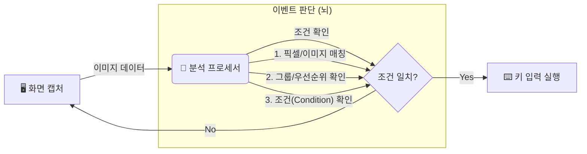

# 🎮 키스트로크 시뮬레이터 (Keystroke Simulator) 사용 설명서

환영합니다! 이 프로그램은 여러분의 컴퓨터 화면을 **"보고"**, 특정 상황이 발생하면 자동으로 **"키를 눌러주는"** 스마트한 매크로 도구입니다. 복잡한 반복 작업을 자동화하거나, 게임 등에서 특정 이미지/색상을 인식해 반응하는 용도로 사용할 수 있습니다.

이 문서는 프로그램의 작동 원리부터 전문가 수준의 설정 방법까지 모든 것을 다룹니다.

---

## 🛠️ 1. 작동 원리 (Mechanism)

이 앱은 단순한 매크로가 아닙니다. **눈(Vision)**과 **뇌(Logic)**, 그리고 **손(Action)**이 있는 로봇과 같습니다.

1.  **화면 캡처 (Capture):** 아주 빠른 속도로 화면의 특정 영역을 찍습니다.
2.  **분석 (Analyze):** 찍은 화면이 여러분이 설정한 이미지나 색상과 일치하는지 `픽셀(Pixel)` 단위로 비교합니다.
3.  **판단 (Logic):** 단순히 이미지만 같다고 누르는 게 아닙니다. "다른 키가 안 눌려 있을 때", "체력이 50% 이하일 때" 같은 논리적 조건을 따집니다.
4.  **실행 (Execute):** 모든 조건이 맞으면 설정된 키보드 키를 누릅니다.

---

## 🏠 2. 메인 화면 구성

프로그램을 실행하면 가장 먼저 만나는 화면입니다.

*(이미지 예시: 상단에 프로세스 선택, 중간에 프로필 선택, 하단에 각종 버튼들)*

1.  **Process (프로세스):** 매크로를 적용할 타겟 프로그램(게임, 웹브라우저 등)을 선택합니다. `Refresh` 버튼으로 목록을 갱신할 수 있습니다.
2.  **Profile (프로필):** 여러 가지 설정 묶음을 저장하고 불러옵니다. `Copy`(복사), `Delete`(삭제)로 관리합니다.
3.  **Start/Stop:** 매크로를 시작하거나 멈춥니다.
4.  **Quick Events:** 빠르고 간단하게 이벤트를 추가하는 미니 에디터입니다.
5.  **Settings:** 전체적인 속도나 반응 키를 설정합니다.
6.  **ModKeys:** Alt, Ctrl, Shift 같은 특수 키의 동작을 설정합니다.
7.  **Edit Profile:** 현재 프로필의 이벤트를 상세하게 수정하는 **핵심 기능**입니다.

---

## ⚙️ 3. 프로필 이벤트 에디터 (Profile Event Editor) - **핵심 기능**

`Edit Profile` 버튼을 누르면 나오는 화면입니다. 여기서 로봇의 "지능"을 만듭니다.

### 📋 리스트 화면
이벤트 목록이 나옵니다.
*   **Use:** 체크 해제하면 해당 이벤트는 잠시 꺼둡니다.
*   **⚡ (Independent):** 번개 아이콘은 "독립 스레드"로 동작함을 의미합니다 (매우 빠름).
*   **Group:** 같은 그룹끼리는 동시에 실행되지 않고 순서를 따집니다.
*   **Actions:** ⚙️(수정), 📝(복사), 🗑️(삭제)

---

### 📝 이벤트 설정 창 (Event Settings)

`Add Event`나 ⚙️ 버튼을 누르면 나오는 상세 설정 창입니다. 3개의 탭으로 나뉩니다.

#### ① Basic (기본 설정)
가장 기초적인 "어디를 보고 무슨 키를 누를지" 정합니다.

*   **이미지 뷰어:**
    *   **왼쪽 (빨강):** 현재 마우스 위치의 실시간 화면.
    *   **오른쪽 (회색):** `Ctrl`을 눌러서 캡처한 "목표 이미지"입니다.
    *   **Ref (작은 박스):** 비교할 기준이 되는 딱 하나의 "기준 픽셀" 색상입니다.
*   **단축키:**
    *   **`Alt`:** 마우스 좌표만 가져옵니다.
    *   **`Ctrl`:** 현재 마우스 위치의 이미지를 캡처(Grab)합니다.
*   **좌표 (Area/Pixel X, Y):** 자동으로 입력되지만, 미세 조정이 필요하면 숫자를 바꿉니다.
*   **Key:** 조건이 맞았을 때 누를 키를 선택합니다.

#### ② Detail/Region (상세/지역 설정)
더 정교한 이미지 인식 방법을 설정합니다.

*   **Matching Mode (매칭 모드):**
    *   **Pixel (1px):** 딱 점 하나(픽셀)의 색상만 봅니다. 속도가 매우 빠릅니다. 고정된 UI(체력바, 스킬 아이콘)에 적합합니다.
    *   **Region (Area):** 일정 영역(사각형) 전체를 비교합니다. 이미지가 조금 움직이거나 패턴을 찾아야 할 때 씁니다.
*   **Region Size:** Region 모드일 때 검사할 사각형의 크기입니다.
*   **Timing (타이밍):**
    *   **Duration:** 키를 얼마나 오래 누르고 있을지(ms) 설정합니다.
    *   **Random:** 기계적인 느낌을 줄이기 위해 누르는 시간을 랜덤하게 ± 합니다. (예: 100ms ± 10ms)
*   **⚡ Independent Thread (독립 스레드):**
    *   체크하면 이 이벤트는 **별도의 뇌(스레드)**를 할당받습니다.
    *   다른 이벤트들이 검사하느라 바빠도, 이 이벤트는 독자적으로 초고속으로 감시하고 실행합니다. (반응속도가 생명인 물약 먹기 등에 사용)

#### ③ Logic/Group (논리/그룹 설정) - **고급 기능**
단순 반복이 아닌 "판단"을 하게 만듭니다.

*   **Execution Type:**
    *   **Execute Key Action:** 체크를 끄면 키를 누르지 않습니다. "조건 체크용" 감시 카메라로만 쓸 때 사용합니다.
*   **Grouping (그룹):**
    *   **Group ID:** 여러 이벤트를 하나의 그룹으로 묶습니다. (예: '공격스킬' 그룹)
    *   **Priority:** 그룹 내에서 누가 더 중요한지 정합니다. (숫자가 낮을수록 우선순위 높음).
    *   *원리:* 같은 그룹 내에서는 한 번에 딱 하나의 이벤트만 실행됩니다. 우선순위 높은 것이 발동 조건이 되면, 낮은 것은 무시됩니다.
*   **Conditions (조건):** **"다른 이벤트의 상태"**를 조건으로 겁니다.
    *   아래 리스트에서 다른 이벤트를 클릭하여 상태를 설정합니다.
    *   `Active (True)`: 저 이벤트가 켜져 있어야 나도 켜진다.
    *   `Inactive (False)`: 저 이벤트가 꺼져 있어야(안 보일 때) 내가 켜진다.
    *   `Ignore`: 상관없다.
    *   *예시:* "보스 몬스터 체력바(이벤트 A)"가 `Active`일 때만 "필살기(이벤트 B)"를 쓴다.

---

## 📥 4. 가져오기 기능 (Import)

다른 프로필에서 이미 잘 만들어둔 이벤트를 가져올 수 있습니다. 노가다를 줄여줍니다!

1.  Event List 창에서 `Import From` 버튼을 누릅니다.
2.  **Profile:** 가져올 원본 프로필을 선택합니다.
3.  **Events:** 가져오고 싶은 이벤트들을 체크합니다.
4.  `OK`를 누르면 현재 프로필로 복사됩니다.

---

## ⚡ 5. 퀵 이벤트 에디터 (Quick Events)

메인 화면의 `Quick Events` 버튼입니다. 복잡한 설정 없이 빠르게 좌표와 이미지만 따고 싶을 때 씁니다.

1.  창을 켜두고 게임 화면 위에 마우스를 올립니다.
2.  **`Alt`**: 좌표 확인 / **`Ctrl`**: 이미지 캡처 및 저장.
3.  캡처된 내용은 자동으로 `Quick.pkl` 프로필에 저장됩니다. 나중에 정식 에디터에서 불러와서 다듬으면 편합니다.

---

## 🎹 6. 특수 키 제어 (ModKeys)

메인 화면의 `ModKeys` 버튼입니다.
매크로가 돌아가는 도중 여러분이 `Alt`, `Ctrl`, `Shift` 등을 눌렀을 때 어떻게 할지 정합니다.

*   **Enabled:** 체크하면 해당 특수 키 감지를 켭니다.
*   **Combobox (Key):** 특수 키를 눌렀을 때 대신 누를 키를 지정합니다. (예: 내가 Alt를 누르면 매크로는 'K'를 누른 것으로 인식)
*   **Pass:** 체크하면 매크로를 **잠시 멈추고** 여러분의 키 입력을 컴퓨터에 그대로 전달합니다. 매크로 중 수동 조작이 필요할 때 유용합니다.

---

## ⚙️ 7. 환경 설정 (Settings)

*   **Start/Stop Key:** 매크로를 켜고 끌 단축키를 지정합니다. (기본값: `` ` `` 또는 `Alt+Shift`)
*   **Key pressed time (min/max):** 키를 누르고 있는 기본 시간 범위입니다. (너무 짧으면 게임이 인식을 못 합니다. 보통 95~135ms 추천)
*   **Delay between loop:** 한 번 검사하고 다음 검사까지 쉴 시간입니다.
*   **Cluster epsilon:** 화면 캡처 영역을 합칠 때 사용하는 수학적 수치입니다. (기본값 20 권장. 건드리지 않아도 됩니다.)

---

## 🚀 8. 실행 방법 (Step-by-Step)

1.  **Process 선택:** 게임이나 프로그램을 켭니다. 앱에서 `Refresh` 후 해당 프로세스를 선택합니다.
2.  **Profile 생성/선택:** 새 이름을 입력하거나 기존 프로필을 고릅니다.
3.  **이벤트 추가:** `Edit Profile` -> `Add Event`로 가서 `Ctrl`키로 이미지를 따고 키를 설정합니다.
4.  **저장:** 설정창에서 `OK`, 리스트창에서 `Save`를 꼭 누릅니다.
5.  **시작:** 메인 화면에서 `Start` 버튼을 누르거나 설정한 `Start/Stop Key`를 누릅니다.
    *   *소리가 나며 시작됩니다.*

---

## ❓ 문제 해결 (Troubleshooting)

*   **Q: 키가 안 눌려요!**
    *   A: `Settings`에서 `Key pressed time`을 조금 늘려보세요. 게임마다 최소 입력 시간이 다릅니다.
    *   A: 관리자 권한으로 프로그램을 실행해 보세요.
*   **Q: 인식이 안 돼요!**
    *   A: 게임 그래픽 설정이 바뀌었는지 확인하세요. `Region` 모드를 쓰거나 `Ref` 픽셀을 다시 잡으세요.
*   **Q: 매크로가 너무 느려요.**
    *   A: 중요한 이벤트는 `Independent Thread`를 체크하세요.
    *   A: `Settings`의 `Delay between loop` 값을 줄이세요.
*   **Q: 종료하고 싶어요.**
    *   A: `Start/Stop` 키를 누르거나, `ESC` 키를 연타하면 강제 종료됩니다.

---
**⚠️ 주의사항:** 이 프로그램은 강력한 자동화 도구입니다. 온라인 게임 등에서 사용 시 약관 위반으로 제재를 받을 수 있으니, 사용에 대한 책임은 사용자에게 있습니다.